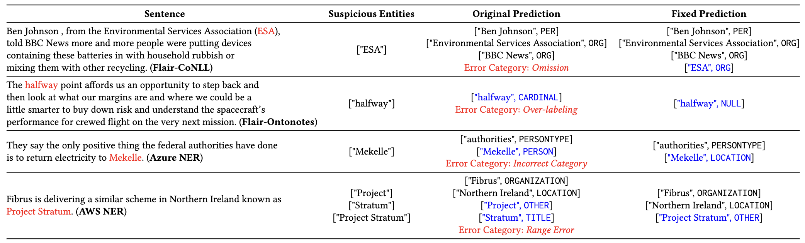

# Named Entity Recognition Testing


We provide the data and code for NER testing and NER repairing of TIN, which are in the directory and [TIN_Test](TIN_Test) and [TIN_Repair](TIN_Repair), respectively.

### Environment

```
python == 3.7
pytorch == 1.7.1
Transformers == 3.3.0
nltk
stanfordcorenlp
```

### Get start
We provide tutorial for users about the usage of NER testing and NER repairing, which are in the corresponding directory, [TIN_Test/README.md](TIN_Test/README.md), [TIN_Repair/README.md](TIN_Repair/README.md).

### Performance of our NER repair Toolkit:
Our Toolkit can reduce 42.6% of the NER errors on AWS NER system, and reduce 50.6% of the NER errors on Azure NER system.
Examples of using TIN to detect the NER errors and then fix them are shown as below:


### Citation
🔭:If you use any tools or datasets in this project, please kindly cite the following paper: Boxi Yu, Yiyan Hu, Qiuyang Mang, Wenhan Hu, Pinjia He.
+ [**ESEC/FSE'23**] 
ACM Joint Meeting on European Software Engineering Conference and Symposium on the Foundations of Software Engineering (ESEC/FSE)*, 2023.
